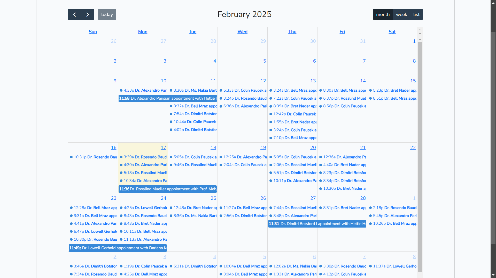
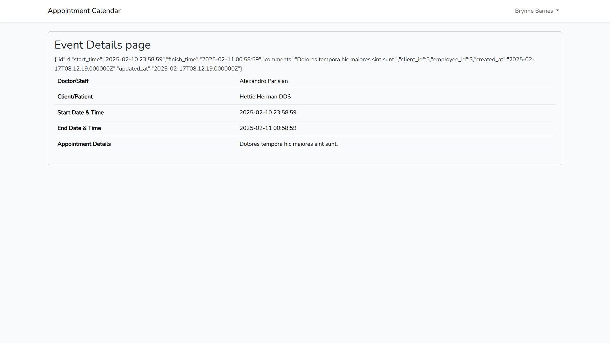

## Calendar in Laravel

This repository is a simple implementation of a calendar in a Laravel project using [The Most Popular JavaScript Calendar](https://fullcalendar.io/)

## Do the following steps after cloning the repo:

1. Run `composer install`
2. Run `npm install`
3. Run `npm run dev`
4. Run `cp .env.example .env` or `copy .env.example .env`
5. Run `php artisan key:generate`
6. Run `php artisan migrate`
7. Run `php artisan db:seed`
8. Run `php artisan serve`
9. Go to link `localhost:8000` OR `127.0.0.1:8000`

## The calendar plotting appointments perday

## Sample of appointment details page after clicking in the appointment in the calendar

